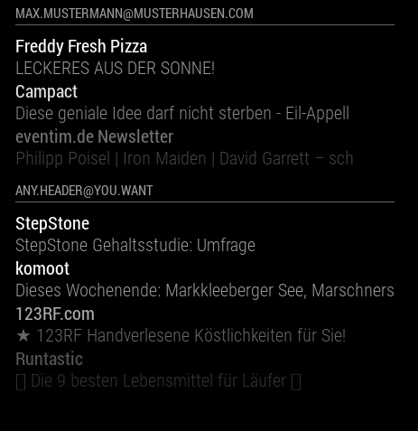

# Module: MMM-Mail

Lightweight IMAP e-mail scanner with new-mail alert. Displays unread mails
from a **configurable mailbox/folder** — useful when server-side filters
(Gmail labels mapped to IMAP folders, Outlook rules) move only the messages
you actually want on the mirror.

This is our fork of [MMPieps/MMM-Mail](https://github.com/MMPieps/MMM-Mail)
(pinned at upstream commit `c24f973`), with one addition: the `mailbox`
config option. Original credit to **MMPieps** and **ronny3050**.



## Install

The module ships in this repository under
`MagicMirror/modules/MMM-Mail/`. On the Pi:

```shell
cd ~/MagicMirror/modules/MMM-Mail
npm install
```

## Configuration

```javascript
{
    module: 'MMM-Mail',
    position: 'bottom_left',
    header: 'Email',
    classes: 'Domes',
    config: {
        user: 'johndoe@gmail.com',
        pass: 'app-password',
        host: 'imap.gmail.com',
        port: 993,
        mailbox: 'Mirror',          // server-side filter target
        numberOfEmails: 5,
        fade: true,
        subjectlength: 50,
    },
}
```

### Options

| Option | Description | Default |
|---|---|---|
| `user` | Full email address | — |
| `pass` | IMAP password (Gmail: app password; Outlook: OAuth2 token) | — |
| `host` | IMAP hostname (e.g. `imap.gmail.com`, `outlook.office365.com`) | — |
| `port` | IMAP port | `993` |
| `mailbox` | IMAP folder to watch and display | `INBOX` |
| `numberOfEmails` | Max number of unread mails shown | `5` |
| `fade` | Fade older entries to black | `true` |
| `subjectlength` | Truncate subject lines to N chars | `50` |

### Folder filtering tips

- **Gmail:** create a label, then set up a filter (Settings → Filters and
  Blocked Addresses → Create new filter → "Apply the label …"). The label
  is exposed over IMAP as a folder of the same name. Use it as `mailbox`.
- **Outlook / Office 365:** create a server-side rule that moves matching
  messages into a custom folder, then point `mailbox` at that folder name.

### Profile gating

Add `classes: 'Domes'` (as in the example above) so the module is only
visible while `MMM-Profile` reports the matching user as present. Hidden
for anonymous viewers.

## Notes

- Outlook personal accounts (`outlook.com`, `hotmail.com`) require IMAP
  XOAUTH2 since Microsoft disabled basic auth in 2024. `pass` cannot be a
  plain password there — pre-populate it with an OAuth2 access token, or
  switch to a fork that handles refresh.
- `node_helper.js` calls `client.selectMailbox(mailbox)`; mailbox names are
  case-sensitive and must match the IMAP path exactly (Gmail nested labels
  use `/` as the separator, e.g. `Receipts/Banks`).
